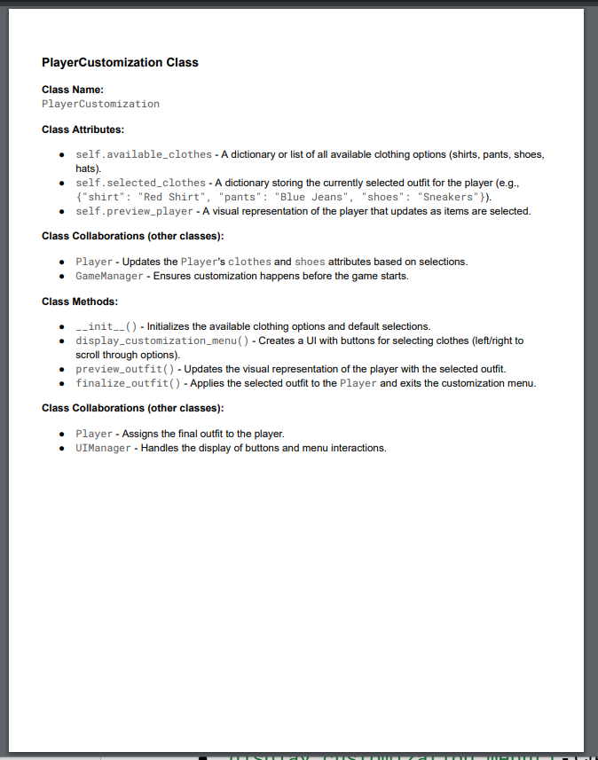
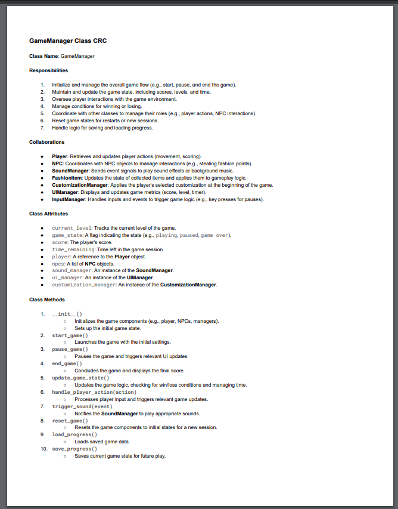
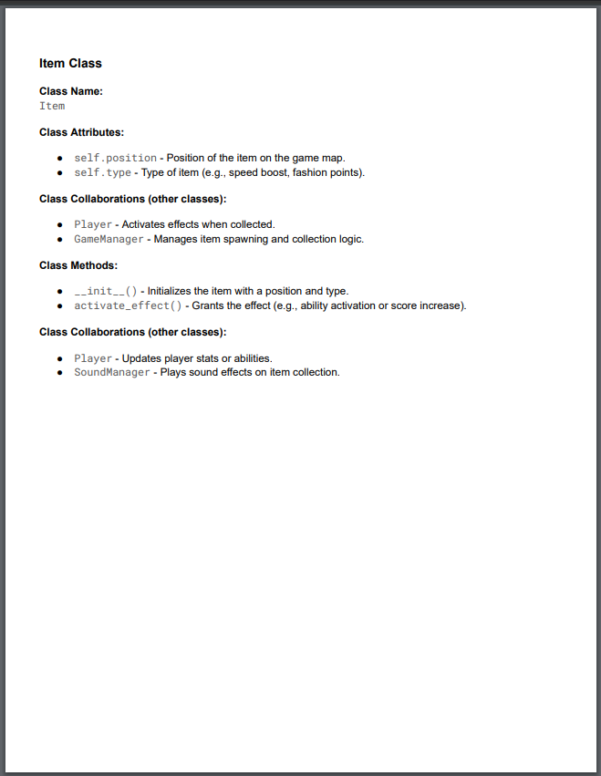
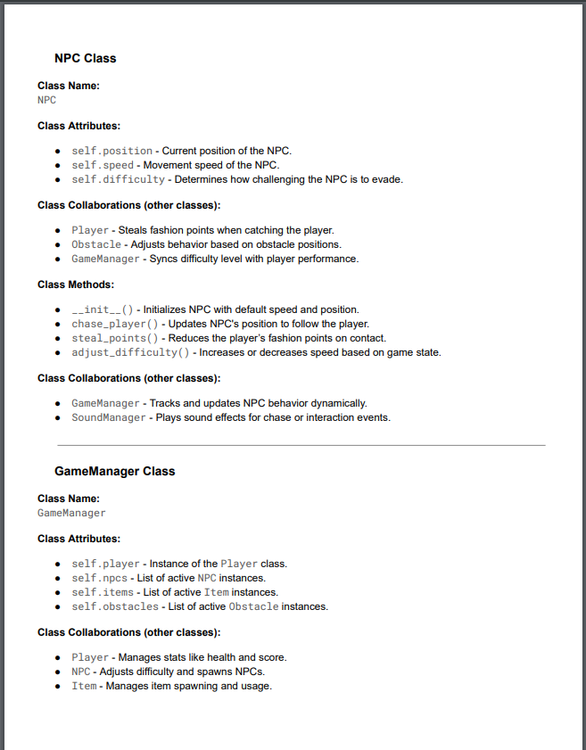
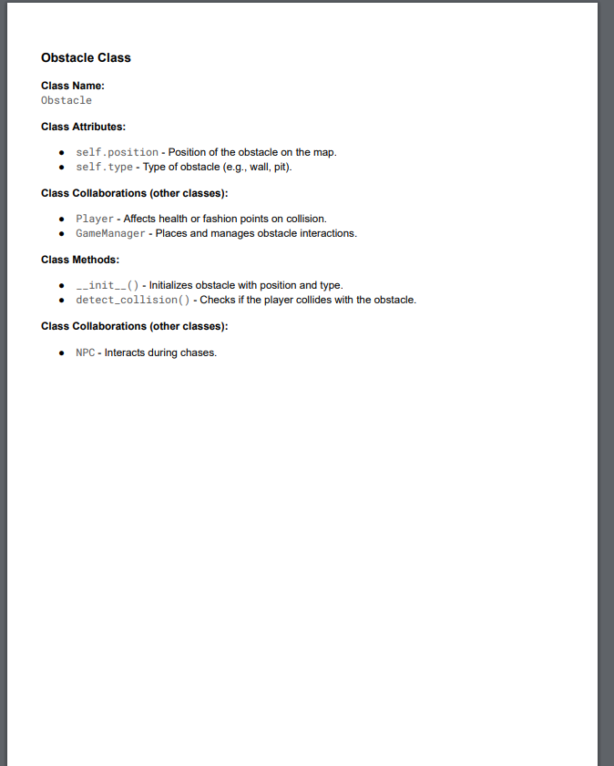
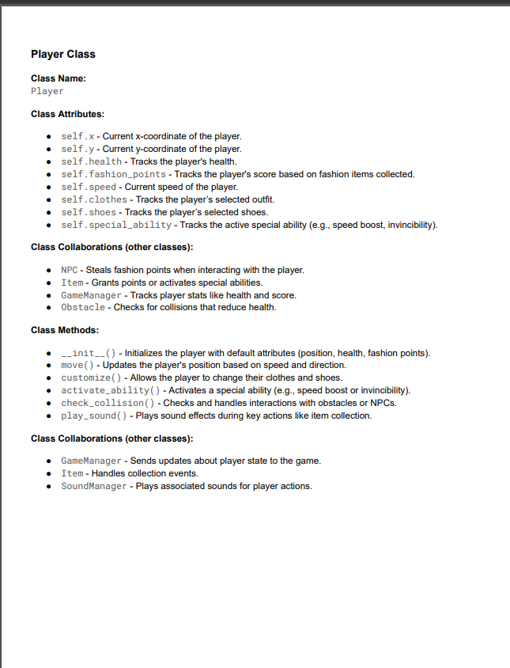
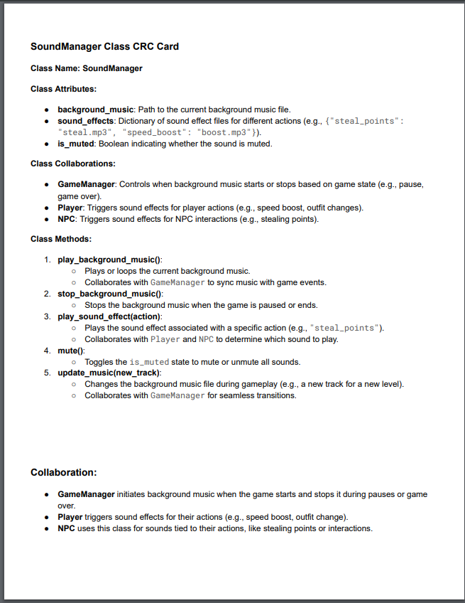

# ❗CSC226 Final Project

## Instructions

❗️Exclamation Marks ❗️indicate action items; you should remove these emoji as you complete/update the items which 
  they accompany. (This means that your final README should have no ❗️in it!)

❗️**Author(s)**: Kamau Clark

❗️**Google Doc Link**:https://docs.google.com/document/d/1Zt-8lDvgDnel3YQB62R4ndwahFe9xSVEye8kZplHGv4/edit?usp=sharing

---

## References 
Throughout this project, you have likely used outside resources. Reference all ideas which are not your own, 
and describe how you integrated the ideas or code into your program. This includes online sources, people who have 
helped you, AI tools you've used, and any other resources that are not solely your own contribution. Update as you go.

---

## Milestone 1: Setup, Planning, Design

❗️**Title**: `Fashion Demon`

❗**Purpose**: `A 2D sliding landscape game where players customize their characters, evade a chasing NPC, and navigate obstacles while enjoying background music. The player can jump, run, and slide to escape and protect their fashion!
    - Customize character's fashion
    - Evade a chasing NPC
    - Navigate through challenging obstacles
    - Enjoy background music
Key Features:
    - Player customization (clothes, shoes)
    -  NPC chase mechanics
    - Sliding 2D landscape
    - Player movement (jump, run, slide)
`

❗️**Source Assignment(s)**: 
`Reference: 
The Legend of Tuna: Breath of Catnip,
Class examples for player movement and collision detection,
Homework 3: Adding audio to Python projects.
Turtle Graphics Homework 4
Online Sources:
OpenAI's ChatGPT for code refactoring, debugging, and game feature suggestions.
Chatgpt(For understanding and help. Also to organize code better)
Pygame Documentation for rendering and event handling.
Stack Overflow for debugging and improving platform scaling.
Teammates and Classmates:
Feedback from peers helped refine gameplay and visuals.
`
❗️**CRC Card(s)**:
  - Create a CRC card for each class that your project will implement.
  - See this link for a sample CRC card and a template to use for your own cards (you will have to make a copy to edit):
    [CRC Card Example](https://docs.google.com/document/d/1JE_3Qmytk_JGztRqkPXWACJwciPH61VCx3idIlBCVFY/edit?usp=sharing)
  - Tables in markdown are not easy, so we suggest saving your CRC card as an image and including the image(s) in the 
    README. You can do this by saving an image in the repository and linking to it. See the sample CRC card below - 
    and REPLACE it with your own:
  
!## CRC Cards
(https://docs.google.com/document/d/1JE_3Qmytk_JGztRqkPXWACJwciPH61VCx3idIlBCVFY/edit?usp=sharing))
### FashionItem CRC


### GameManager CRC


### Item CRC


### NPC CRC


### Obstacle CRC


### Player CRC


### SoundManager CRC


❗️**Branches**: This project will **require** effective use of git. 

Each partner should create a branch at the beginning of the project, and stay on this branch (or branches of their 
branch) as they work. When you need to bring each others branches together, do so by merging each other's branches 
into your own, following the process we've discussed in previous assignments: 

```
  Branch 1 name: Clarkk2 -
  player-actions  
  npc-mechanics: Develop NPC chase logic 
  obstacle-handling 
  ui-customization`: Create character customization interface 
```
---

## Milestone 2: Code Setup and Issue Queue

Most importantly, keep your issue queue up to date, and focus on your code. 🙃

Reflect on what you’ve done so far. How’s it going? Are you feeling behind/ahead? What are you worried about? 
What has surprised you so far? Describe your general feelings. Be honest with yourself; this section is for you, not me.

```
    **Feelings for the beginning: I’m excited about the project but slightly worried about managing all the interactions between the classes. I plan to start small with basic player movement and build on that step by step. I’ve created some placeholder assets for testing, and the overall plan feels manageable.

** /project-directory
  - main.py
  - player.py
  - npc.py
  - fashion_item.py
  - sound_manager.py
  - game_manager.py
  - obstacle.py
  - item.py
  - test_suite.py**
```
## Milestone 3: Virtual Check-In

Indicate what percentage of the project you have left to complete and how confident you feel. 

❗️**Completion Percentage**: `90%`

❗️**Confidence**: Describe how confident you feel about completing this project, and why. Then, describe some 
  strategies you can employ to increase the likelihood that you'll be successful in completing this project 
  before the deadline.

```
    ** I'm confident the core functionality works as intended, but some features (like platform aesthetics and smoother NPC chasing) could use polishing. Testing helped refine key aspects like player jumping, platform collisions, and the game-over sequence.
Strategies for Success:

Conduct final testing to ensure stability.
Focus on presentation and user instructions to make the game easy to use.
```

---

## Milestone 4: Final Code, Presentation, Demo

### ❗User Instructions
In a paragraph, explain how to use your program. Assume the user is starting just after they hit the "Run" button 
in PyCharm. 
User Instructions:
Run the main.py file in PyCharm or your IDE of choice.
Use arrow keys to move left and right. Press the spacebar to jump.
Collect coins to increase your score, and avoid being caught by the Fashion Demon.
The game ends if the Fashion Demon catches you or if you fall off the map.
On the "Game Over" screen, press R to restart.

### ❗Errors and Constraints
Every program has bugs or features that had to be scrapped for time. These bugs should be tracked in the issue queue. 
You should already have a few items in here from the prior weeks. Create a new issue for any undocumented errors and 
deficiencies that remain in your code. Bugs found that aren't acknowledged in the queue will be penalized.

Known Bugs:
Platform scaling works but requires correctly cropped images to avoid distortion.
Some placeholder assets might not match the final design intent.
Time Constraints:
Features like player customization and NPC vertical movement were scrapped.
### ❗Reflection
In three to four well-written paragraphs, address the following (at a minimum):
- Why did you select the project that you did?
- How closely did your final project reflect your initial design?
- What did you learn from this process?
- What was the hardest part of the final project?
- What would you do differently next time, knowing what you know now?
- (For partners) How well did you work with your partner? What made it go well? What made it challenging?
Reflection
I chose the Fashion Demon project because it allowed me to blend creativity and technical skills. The concept of escaping a chasing NPC while collecting coins on platforms was simple enough to implement yet provided opportunities to expand with additional features like score tracking, level transitions, and a "Game Over" screen. Additionally, designing a game was a fun way to challenge myself, combining logic, visual design, and user interaction.

The final project reflects my initial design fairly closely. Key features like NPC chasing, coin collection, platform navigation, and a dynamic scoring system were successfully implemented. However, there were some deviations due to time constraints, such as scrapping advanced features like player customization and more complex platform designs. Simplifications like replacing "items" with coins ensured the game remained playable while still being engaging. Despite these changes, the essence of the original design remained intact.

Throughout this process, I learned the importance of testing and debugging incrementally. Starting with basic functionality, like player movement and collisions, and gradually adding features helped maintain progress while minimizing setbacks. I also gained a deeper understanding of Pygame, especially with image scaling, rendering, and event handling. Balancing creativity with technical implementation taught me to prioritize functionality over unnecessary complexity.

The hardest part of the project was ensuring visual fidelity, particularly with platform images. Cropping and scaling the platform images to fit the game world without distortion was unexpectedly challenging. Managing interactions between multiple classes, like the player, NPC, and platforms, also required careful coordination.

If I were to start again, I would allocate more time to designing assets and testing earlier in the development process. A clearer plan for class interactions and game states would have saved time spent troubleshooting later. Overall, this project was a rewarding experience that showcased the importance of planning, perseverance, and adaptability.